# TextPrism — Visual Lexicon Engine for Expressive Documents

## ✨ Visual Showcase

### The Landing Page: Simple & Powerful
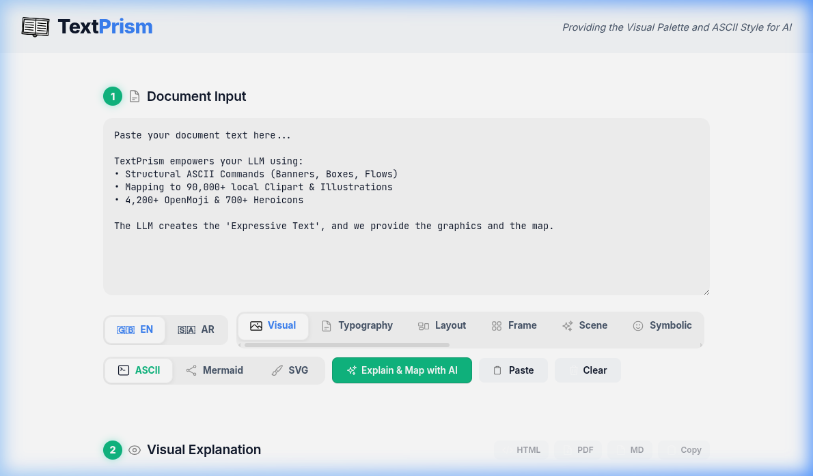
*A clean, modern interface designed for rapid experimentation and expressive AI output.*

### SVG Vector Infographics
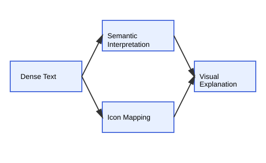
*Deeper than just icons. TextPrism can render complex, scalable vector infographics and architectural diagrams directly from your text.*

### 🛠️ Icon Mapping & ASCII Frames
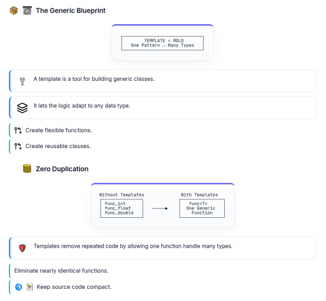
*Behold the power of hybrid explanations. Every sentence is mapped to a vibrant icon from the 90k+ lexicon, while concepts are framed in pixel-perfect ASCII art via the **SHAPE_IT** engine.*

### 📊 Professional Diagramming (Mermaid.js)
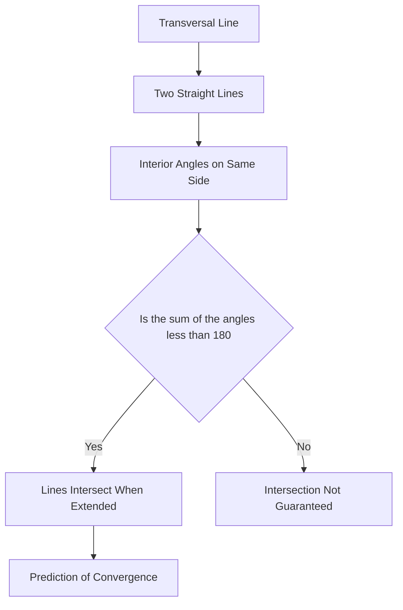

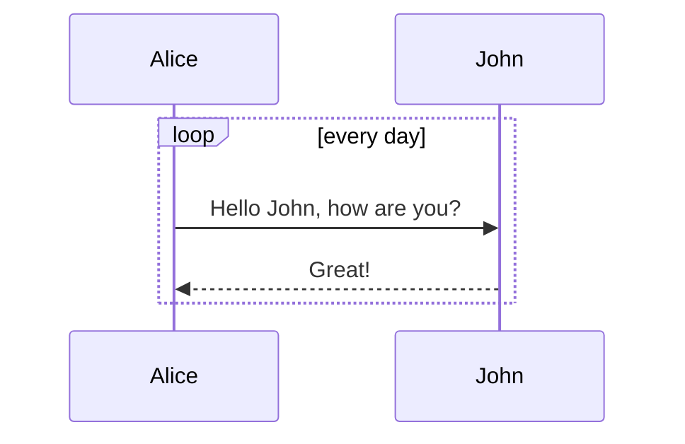

*Generate sophisticated flowcharts, sequence diagrams, and architecture maps directly from your LLM prompts.*
---                       
## 📋 Summary
TextPrism is a system designed to convert ordinary written information into visually structured explanations that are easier to explore and understand. Instead of relying only on paragraphs, the platform maps sentences to visual signals such as icons, diagrams, and structured layouts. By combining artificial intelligence, massive icon libraries, and automated document rendering, the system bridges the gap between dense information and intuitive visual storytelling.

   

---

###  Visual Mapping Engine

```
┌──────────────────────────────┐
│        DENSE TEXT INPUT      │
└──────────────┬───────────────┘
               │                
               ▼                
     ┌───────────────────┐      
     │  VISUAL MAPPING   │      
     │      ENGINE       │      
     └───────┬───────────┘      
             │                  
             ▼                  
   ┌───────────────────────┐    
   │  ICONS + STRUCTURE    │    
   │  VISUAL ORGANIZATION  │    
   └──────────┬────────────┘    
              ▼                 
      ┌─────────────────┐       
      │ VISUAL EXPLANATION │    
      └─────────────────┘       
```

 TextPrism operates as a visual mapping engine that analyzes written content and reorganizes it into structured visual explanations. <!--  -->

 The engine interprets the semantic meaning of each sentence so that information can be represented through icons, layout structures, and visual cues. <!--  -->

 Each idea becomes a visual component within a larger explanatory structure, allowing readers to see relationships between concepts. <!--  -->

 This transformation makes dense information easier to absorb because the brain processes visual patterns faster than plain text. <!--  -->

- Transforms dense text into visual explanations
-  Maps sentences to icons and structures
- Improves comprehension through visual cognition

### 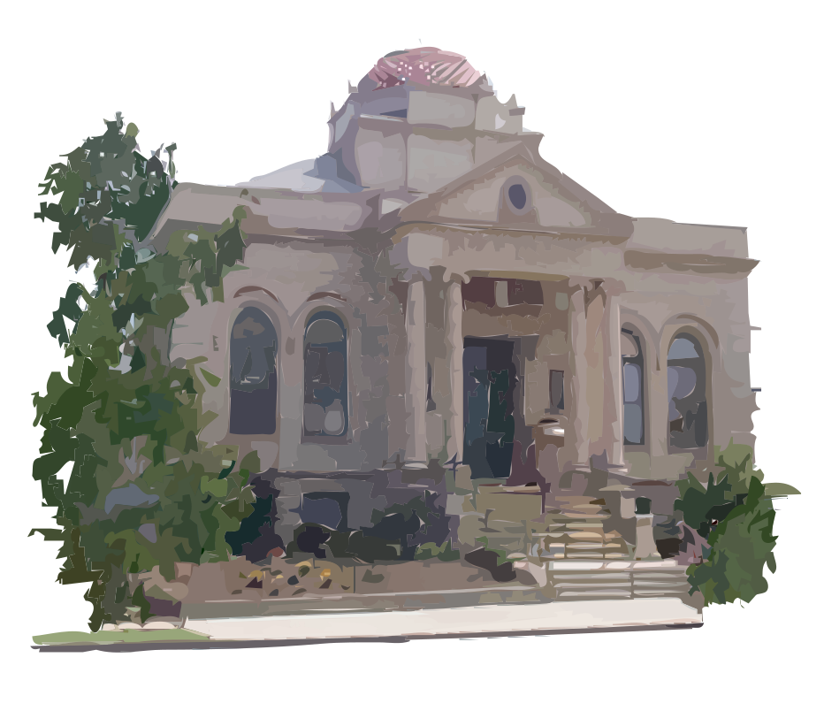 Massive Visual Lexicon

```
            ┌────────────────────┐        
            │   VISUAL LEXICON   │        
            │     90,000+        │        
            └───────┬────────────┘        
                    │                     
   ┌──────────────┬─┼─┬──────────────┐    
   ▼              ▼   ▼              ▼    
┌───────┐     ┌──────────┐     ┌─────────┐
│Icons  │     │ Clipart  │     │Images   │
└───────┘     └──────────┘     └─────────┘
                                          
      All stored locally                  
        (offline assets)                  
```

 TextPrism includes a massive visual lexicon composed of more than ninety thousand graphical assets. <!--  -->

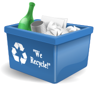 These assets consist of icons, clipart, and illustrations stored locally as a large offline library. <!--  -->

 The system selects visuals from this library to reinforce the meaning of each sentence. <!--  -->

 Because the assets are stored offline, the system maintains reliability and speed without relying on external resources. <!--  -->

-  Over 90,000 visual assets available
-  Includes icons, clipart, and illustrations
- Stored locally for offline reliability

###  LLM-Generated ASCII Visual Art

```
  ┌───────────────┐  
  │      LLM      │  
  │ AI GENERATOR  │  
  └───────┬───────┘  
          │          
          ▼          
┌───────────────────┐
│  SHAPE-IT STYLE   │
│  ASCII DIAGRAMS   │
└─────────┬─────────┘
          │          
          ▼          
 ┌────────────────┐  
 │ VISUAL TEXT ART│  
 │ STRUCTURED FLOW│  
 └────────────────┘  
```

 TextPrism integrates large language models to generate expressive ASCII diagrams that visually organize ideas. <!--  -->

 These diagrams follow the 'shape-it ascii art style', which emphasizes boxes, connectors, and structural layouts. <!--  -->

 The generated ASCII art functions like a diagram drawn with text characters, allowing information to be presented visually even in plain-text environments. <!--  -->

 This collaboration between AI creativity and structured formatting produces explanations that feel both analytical and artistic. <!--  -->

- ASCII diagrams generated by language models
-   Shape-it style creates boxes and visual structures
- 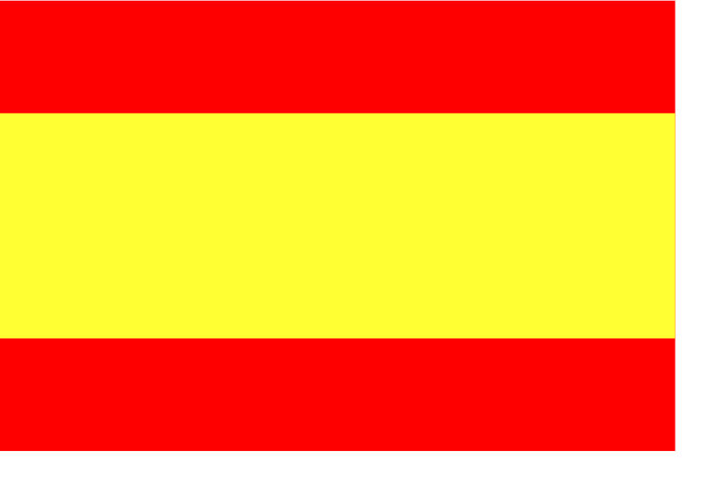 Useful for plain text environments

###  Multiple Explanation Styles

```
           ┌─────────────────┐            
           │ EXPLANATION HUB │            
           └─────────┬───────┘            
                     │                    
     ┌───────────────┼───────────────┐    
     ▼               ▼               ▼    
┌────────┐     ┌──────────┐     ┌────────┐
│Visual  │     │Narrative │     │ Q&A    │
└────────┘     └──────────┘     └────────┘
     ▼               ▼               ▼    
┌────────┐     ┌──────────┐               
│Frame   │     │Semantic  │               
└────────┘     └──────────┘               
```

 TextPrism provides thirteen explanation styles that adapt the presentation of information to different audiences. <!--  -->

 These styles include visual explanations, narrative storytelling, frame-based walkthroughs, question-and-answer formats, and semantic analyses. <!--  -->

 Each style changes the structure of the explanation so that the same content can emphasize storytelling, logical flow, or visual clarity. <!--  -->

 This flexibility ensures that educational content can be optimized for learners with different preferences. <!--  -->

- 13 explanation formats available
- Includes narrative, Q&A, frame-based, and semantic styles
- Allows adaptation to audience learning styles

###  Arabic Language and RTL Support

```
  LANGUAGE ADAPTATION SYSTEM
                            
┌──────────────┐            
│  LTR Layout  │            
│  (English)   │            
└──────┬───────┘            
       │                    
       ▼                    
┌──────────────┐            
│   ENGINE     │            
│ RTL SUPPORT  │            
└──────┬───────┘            
       ▼                    
┌──────────────┐            
│  RTL Layout  │            
│   (Arabic)   │            
└──────────────┘            
```

 TextPrism supports Modern Standard Arabic translation so that visual explanations can reach a wider global audience. <!--  -->

 The system also handles right-to-left layout rendering, ensuring Arabic text flows naturally across the page. <!--  -->

 Visual structures remain intact even when switching between left-to-right and right-to-left languages. <!--  -->

 This capability ensures multilingual accessibility without sacrificing visual clarity. <!--  -->

- 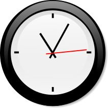  Modern Standard Arabic translation
-   Right-to-left layout rendering
-  Maintains visual structure across languages

###  Server-Side PDF Generation

```
┌──────────────┐
│ HTML LAYOUT  │
│ VISUAL PAGE  │
└──────┬───────┘
       ▼        
┌──────────────┐
│  PLAYWRIGHT  │
│ RENDER ENGINE│
└──────┬───────┘
       ▼        
┌──────────────┐
│   PDF FILE   │
│ MULTI-PAGE   │
└──────────────┘
```

 TextPrism can export visual explanations into high-quality PDF documents generated on the server side. <!--  -->

 The system uses Playwright to render pages exactly as they appear in the browser environment. <!--  -->

 Layout protection ensures diagrams, icons, and text remain aligned even across multiple pages. <!--  -->

 The result is a pixel-perfect document where complex visual explanations remain intact. <!--  -->

-  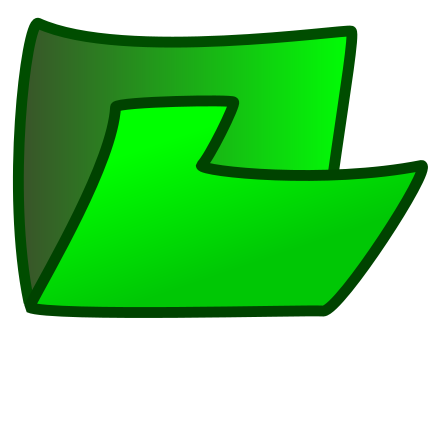 Server-side rendering system
- Built on Playwright
-   Multi-page PDF layout preservation

###  Sentence-Level Icon Mapping

```
SENTENCE → ICON MAPPING
                       
┌──────────────┐       
│   Sentence   │       
└──────┬───────┘       
       ▼               
┌──────────────┐       
│ Vibrancy     │       
│ Ranking      │       
│ Engine       │       
└──────┬───────┘       
       ▼               
┌──────────────┐       
│  Best Icon   │       
│   Selected   │       
└──────────────┘       
```

 TextPrism pairs every sentence with a visual icon to reinforce the meaning of the statement. <!--  -->

 A vibrancy ranking engine analyzes possible icons and selects the most expressive match. <!--  -->

 These visual signals allow readers to scan documents quickly while still understanding key concepts. <!--  -->

 The result is a highly scannable document where visual cues guide comprehension. <!--  -->

-  Icon mapped to every sentence
-  Automated icon ranking system
-  Improves document scannability

###  Automatic Tag Cleanup

```
TAG CLEANUP PIPELINE   
                       
┌─────────────────────┐
│ Text with [tags]    │
│ Semantic markers    │
└──────────┬──────────┘
           ▼           
    ┌──────────────┐   
    │ Tag Stripper │   
    │ Cleanup Step │   
    └──────┬───────┘   
           ▼           
┌─────────────────────┐
│ Clean Final Output  │
│ Reader-ready text   │
└─────────────────────┘
```

 During generation, TextPrism uses semantic tags such as keyword markers to organize visual mappings. <!--  -->

 After processing, the system automatically removes these tags from the final output. <!--  -->

 This ensures that readers see a clean and professional document rather than internal markup. <!--  -->

 The pipeline keeps the intelligence of structured generation while delivering polished text. <!--  -->

- Removes internal semantic tags
- Produces clean final documents
- Maintains structured generation workflow

###  AI-First Development Workflow

```
  AI-FIRST WORKFLOW
                   
┌───────────────┐  
│  REPOMIX      │  
│ CONTEXT PACK  │  
└──────┬────────┘  
       │           
       ▼           
┌───────────────┐  
│ GEMINI.md     │  
│ AI RULES      │  
└──────┬────────┘  
       ▼           
┌───────────────┐  
│ AI CODING     │  
│ OPTIMIZED     │  
└───────────────┘  
```

 TextPrism is designed around an AI-first development approach that optimizes collaboration with language models. <!--  -->

 The system integrates Repomix to package project context for AI tools. <!--  -->

Project-level GEMINI.md rules guide AI behavior so that generated code follows the project's standards.

 This workflow improves efficiency by reducing token waste and ensuring consistent AI-generated outputs. <!--  -->

- Repomix integration for context packaging
-  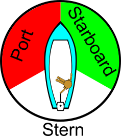 GEMINI.md rules guide AI behavior
- Token-efficient AI-assisted development


---
*Generated by TextPrism — Visual Lexicon for Semantic Text Annotation*


TextPrism empowers your LLM to become a visual communicator. It takes raw text and transforms it into a multi-modal explanation using a vast offline lexicon of 90,000+ icons, structured ASCII frames, and dynamic Mermaid.js diagrams.

---

## Quick Start

### 1. Setup Environment
```bash
# Clone and Setup
git clone https://github.com/Muhammad-Rabieh/TextPrism.git
cd TextPrism

# Create and Activate Virtual Environment
python3 -m venv venv
source venv/bin/activate

# Install Dependencies using local pip module
python3 -m pip install --upgrade pip
python3 -m pip install -r requirements.txt

# Setup PDF high-fidelity engine (Required for PDF Export)
python3 -m playwright install chromium
```

### 2. Launch the Server
```bash
# Recommended: If venv is activated
python3 src/app.py

# Alternatively: Run directly using the venv path
./venv/bin/python3 src/app.py

# Open http://localhost:8000
```

### 3. Running Tests
```bash
# Run the Master Verification Suite
python3 tests/run_all_tests.py
```

---

## Agent-First Developer Setup

TextPrism is optimized for AI-assisted development (e.g., Cursor, Gemini, Claude). We use **Repomix** and a project-level `GEMINI.md` policy to ensure the AI has perfect context while minimizing token usage.

1. **Install Repomix**: `npx -y repomix`
2. **Follow `GEMINI.md` Rules**:
   - Always use **Targeted Context** (`--include`) to focus only on relevant source files.
   - Ignore `data/` and `tests/` asset folders to save 95%+ tokens.
   - Update the `docs/CODE_MAP.md` after significant architectural changes.

This setup allows AI agents to "self-trigger" context gathering only when needed, ensuring a fast and clean developer experience.

---

## Architecture and Reorganized Structure

TextPrism uses a clean, categorized directory structure to maintain scalability:

- src/: Core application logic (app.py, emoji_engine.py, shape_it.py, utils.py).
- data/: The 1.3 GB Visual Lexicon (icons, clipart, indexes).
- docs/: System documentation, roadmap, and implementation plans.
- tests/: Extensive test suite and verification artifacts.
- static/: Frontend assets (Vibrant theme CSS, logic JS).
- templates/: Jinja2 templates for UI and document rendering.
- scripts/: Internal utility scripts for lexicon maintenance.

---

## Core Components

| Component | File | Purpose | Lines |
|------|---------|-------|-------|
| Rendering Engine | src/app.py | FastAPI backend - routes, AI integration, rendering logic. | ~1000 |
| Lexicon Engine | src/emoji_engine.py | Visual Lexicon Engine - 4-layer lookup for 90k assets. | ~500 |
| ASCII Engine | src/shape_it.py | SHAPE_IT ASCII art engine - 16+ programmatic shape functions. | ~630 |
| Utility Layer | src/utils.py | Shared utilities like normalize_ascii(). | ~40 |

---

## Visual Lexicon (90,000+ Assets)

The Lexicon is ranked by Vibrancy, prioritizing multi-colored, highly detailed assets over simple icons.

| Library | Format | Count | Primary Use |
|-------|--------|-------|------|
| OpenMoji | PNG 72x72 | 4,292 | General concepts/emojis |
| Heroicons | SVG | 324 | Clean UI elements |
| OpenClipArt | SVG | ~26,000 | Rich illustrations |
| Lucide/Noto | SVG | ~9,000 | Functional iconography |
| Misc Modules | SVG/PNG | ~50,000+ | Deep niche keyword coverage |

---

## AI Workflow (Multi-Tier)

1. Manual AI (Default): Use our "Magic Prompt" workflow with any web-based LLM.
2. Free API: Built-in support for Gemini 1.5 Flash (Tier 2).
3. Local AI: Full support for Ollama (Mistral/Llama3) for total privacy.
4. Premium API: Works with GPT-4, Claude 3.5, etc.

---

## License

Released under the GPL v3 License.
