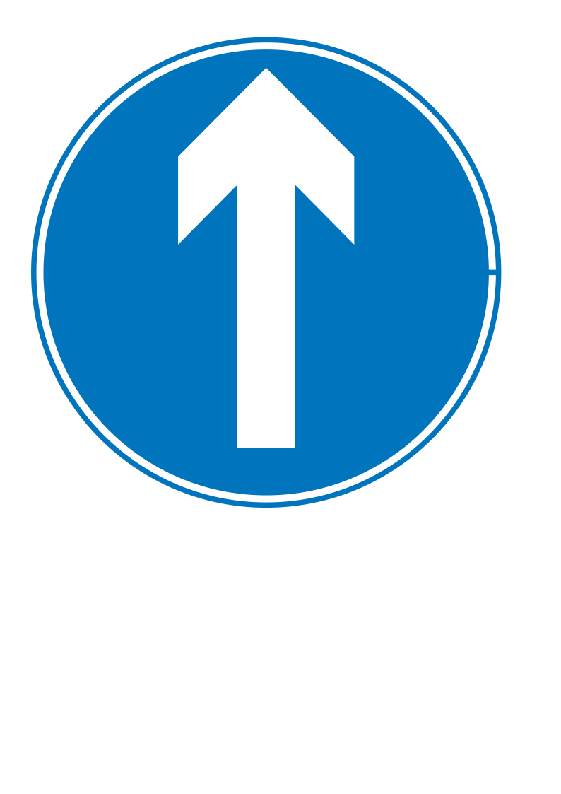
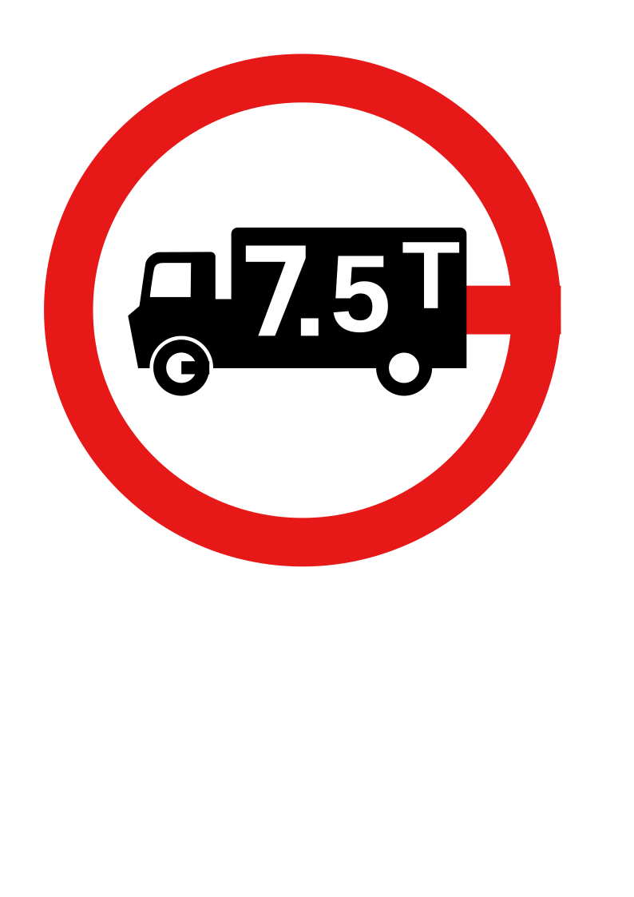

# Understanding Playfair’s Axiom and the Many Faces of the Parallel Postulate

```
 _   _           _               _                  _ _             
| | | |_ __   __| | ___ _ __ ___| |_ __ _ _ __   __| (_)_ __   __ _ 
| | | | '_ \ / _` |/ _ \ '__/ __| __/ _` | '_ \ / _` | | '_ \ / _` |
| |_| | | | | (_| |  __/ |  \__ \ || (_| | | | | (_| | | | | | (_| |
 \___/|_| |_|\__,_|\___|_|  |___/\__\__,_|_| |_|\__,_|_|_| |_|\__, |
                                                              |___/ 
 ____  _              __       _               _          _                 
|  _ \| | __ _ _   _ / _| __ _(_)_ __ ___     / \   __  _(_) ___  _ __ ___  
| |_) | |/ _` | | | | |_ / _` | | '__/ __|   / _ \  \ \/ / |/ _ \| '_ ` _ \ 
|  __/| | (_| | |_| |  _| (_| | | |  \__ \  / ___ \  >  <| | (_) | | | | | |
|_|   |_|\__,_|\__, |_|  \__,_|_|_|  |___/ /_/   \_\/_/\_\_|\___/|_| |_| |_|
               |___/
```

## 📋 Summary
Geometry developed through a small set of foundational statements that guide how lines, angles, and shapes behave on a flat plane. Among these principles, the parallel postulate became one of the most famous because it appears simple yet carries deep consequences for the entire structure of Euclidean geometry. Mathematicians later reformulated this postulate into alternative statements such as Playfair’s axiom, helping clarify the idea of parallel lines. Over time researchers discovered that many seemingly unrelated geometric facts actually rely on this same principle, revealing a hidden network of equivalent truths. Understanding these connections helps us see geometry not as isolated facts but as an interconnected logical system built from shared foundations.

     

---

```
          Playfair's Axiom                       
     ┌─────────────────────────┐                 
     │           • P           │                 
     │          /              │                 
     │         /  unique       │                 
     │        /   parallel     │                 
     │       /                 │                 
─────┼─────────────────────────┼─────  given line
     │                         │                 
     │  Only ONE line through │                  
     │  point P never meets   │                  
     │  the given line        │                  
     └─────────────────────────┘                 
```
###  Playfair’s Axiom: A Clear Form of the Parallel Principle
 Playfair’s axiom states that in a flat plane, if we take a line and a point that does not lie on that line, there can be at most one line through the point that never intersects the original line. <!--  -->
 This statement captures the essence of parallelism by emphasizing uniqueness, meaning the geometry allows only one direction through the point that maintains constant separation from the given line. <!--  -->
 The axiom is named after the Scottish mathematician John Playfair, who presented this clearer version of Euclid’s more complicated original postulate. <!--  -->
 Although the wording differs from Euclid’s formulation, the two statements describe the same geometric behavior when the rest of Euclid’s axioms are assumed. <!--  -->
-  Given a line and an external point
-   Only one possible parallel line exists
- Simplified expression of Euclid’s idea

```
   Logical Relationship            
                                   
 Euclid Postulate                  
        │                          
        │ proof (with other axioms)
        ▼                          
   Playfair Axiom                  
        │                          
        │ reverse proof            
        ▼                          
 Same meaning inside               
 Euclidean Geometry                
                                   
Different systems                  
(hyperbolic, etc.)                 
   may break                       
   equivalence                     
```
###  Logical Relationship with Euclid’s Parallel Postulate
 Playfair’s axiom by itself is not logically identical to Euclid’s parallel postulate because different geometric systems can accept one while rejecting the other. <!--  -->
 For example, alternative geometries such as hyperbolic geometry allow multiple parallels through a point, demonstrating that the rule is not universally necessary. <!--  -->
 However, when the remaining axioms of Euclidean geometry are included, mathematicians can prove that Playfair’s axiom implies the parallel postulate and vice versa. <!--  -->
 This means the two statements become interchangeable within the logical framework known as absolute geometry. <!--  -->
- Not identical in isolation
- Equivalent under Euclidean axioms
- Illustrates dependence on geometric systems

```
     Web of Equivalent Ideas            
                                        
       Triangle angles                  
          = 180°                        
             │                          
             │                          
Similar triangles exist ── Parallel rule
             │                          
             │                          
     Constant distance                  
     between parallels                  
             │                          
             │                          
          Rectangles                    
                                        
  Many facts → same hidden axiom        
```
###  Many Statements Equivalent to the Parallel Postulate
 Over centuries mathematicians discovered that many geometric claims actually depend on the same assumption about parallel lines. <!--  -->
Some of these statements initially appear unrelated to parallelism, yet careful proofs reveal that they stand or fall together with the parallel postulate.
This surprising relationship shows that geometry contains hidden logical links connecting angles, shapes, and distances.
 When one of these statements is assumed to be true, it often becomes possible to prove the parallel postulate itself. <!--  -->
-   Triangle angle sum equals 180°
- Existence of similar but non-congruent triangles
-  All rectangles have four right angles
-  Parallel lines maintain constant distance

```
    Triangle Theorem Links
                          
          /\              
         /  \             
        /____\            
      Right triangle      
                          
    a² + b² = c²          
      (Pythagoras)        
                          
           │              
           ▼              
      Law of Cosines      
   works for ANY triangle 
                          
Measurement rules depend  
on Euclidean parallelism  
```
###  Geometric Theorems that Depend on Parallelism
 Several well-known theorems in geometry secretly rely on the parallel postulate even though they appear to concern triangles or angles instead of parallel lines. <!--  -->
 A famous example is the Pythagorean theorem, which relates the sides of a right triangle and depends on Euclidean properties of space. <!--  -->
The law of cosines generalizes this relationship to all triangles and similarly depends on the same geometric framework.
 These connections reveal that results about measurement and shape ultimately trace back to assumptions about how lines behave in the plane. <!--  -->
- Pythagorean theorem
-  Law of cosines
-   Angle properties of triangles

```
    Quadrilaterals & Infinity
                             
      ┌───────────┐          
      │           │          
      │ Rectangle │          
      │           │          
      └───────────┘          
      4 right angles         
                             
 Saccheri quadrilateral      
    summit angles = 90°      
                             
      ▲                      
      │                      
Triangles can grow           
without area limit           
   (Wallis axiom)            
                             
 Intersecting line           
 hits both parallels         
    (Proclus axiom)          
```
###  Special Quadrilaterals and Infinite Geometry
 Certain geometric constructions also encode the parallel postulate through properties of quadrilaterals and infinite areas. <!--  -->
 For instance, the existence of rectangles with four right angles reflects the Euclidean rule governing parallel sides. <!--  -->
 Statements like the Wallis axiom, which allows triangles to have arbitrarily large area, also depend on the same underlying structure of the plane. <!--  -->
 Additional principles such as Proclus’ axiom about intersecting parallel lines further illustrate how different geometric ideas ultimately express the same foundational assumption. <!--  -->
- Saccheri quadrilateral summit angles
- Existence of rectangles
-  Wallis axiom on triangle area
- Proclus axiom about intersecting parallels


---
*Generated by TextPrism — Visual Lexicon for Semantic Text Annotation*