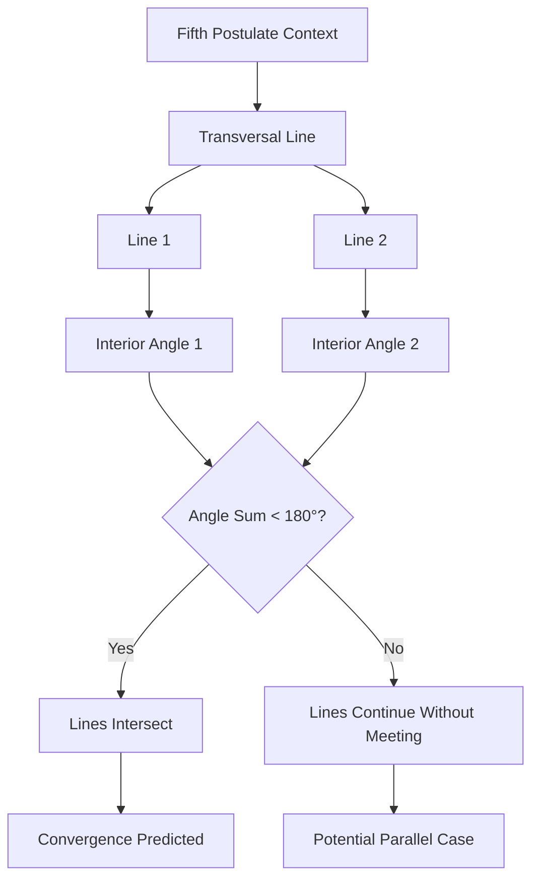
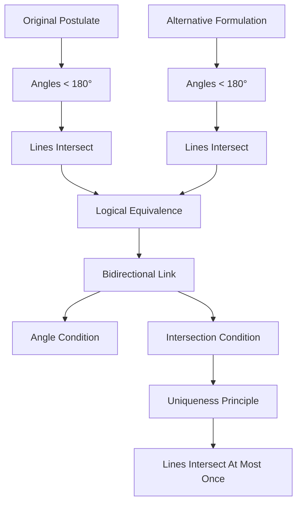
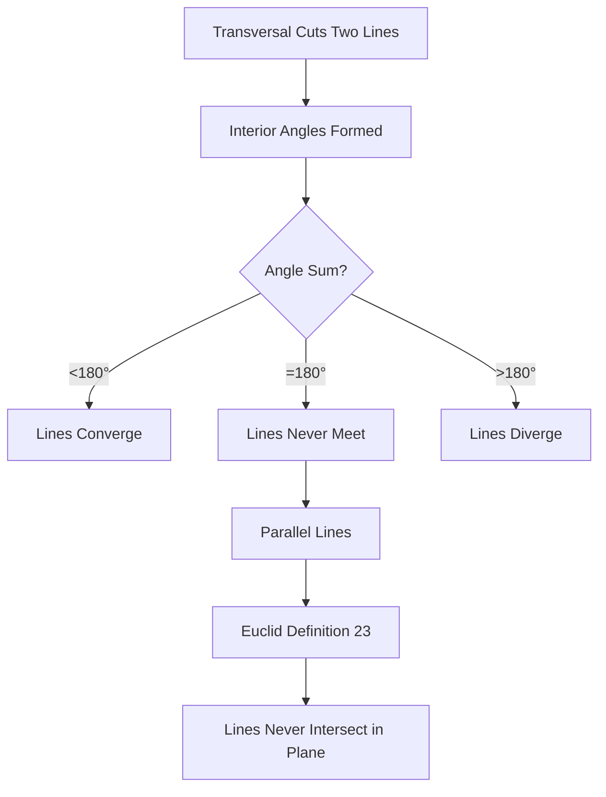
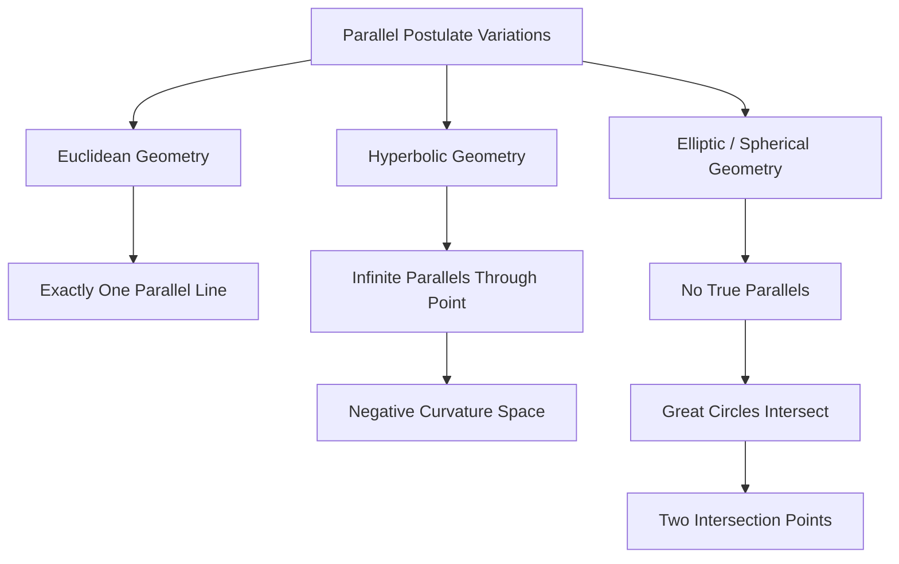
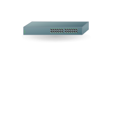
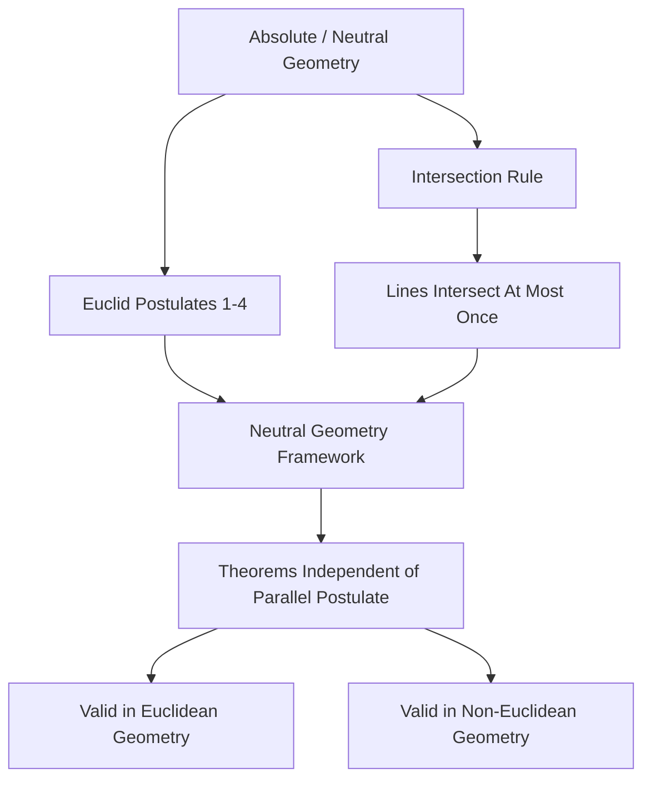
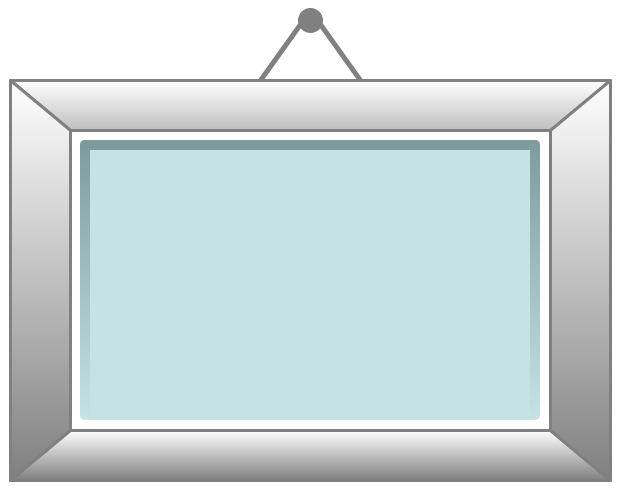

# Euclid's Parallel Postulate and the Geometry Landscape

```
 _____           _ _     _ _       ____                 _ _      _ 
| ____|   _  ___| (_) __| ( )___  |  _ \ __ _ _ __ __ _| | | ___| |
|  _|| | | |/ __| | |/ _` |// __| | |_) / _` | '__/ _` | | |/ _ \ |
| |__| |_| | (__| | | (_| | \__ \ |  __/ (_| | | | (_| | | |  __/ |
|_____\__,_|\___|_|_|\__,_| |___/ |_|   \__,_|_|  \__,_|_|_|\___|_|
                                                                   
 ____           _         _       _                     
|  _ \ ___  ___| |_ _   _| | __ _| |_ ___    __ _ _ __  
| |_) / _ \/ __| __| | | | |/ _` | __/ _ \  / _` | '_ \ 
|  __/ (_) \__ \ |_| |_| | | (_| | ||  __/ | (_| | | | |
|_|   \___/|___/\__|\__,_|_|\__,_|\__\___|  \__,_|_| |_|
```

## 📋 Summary
The parallel postulate is a unique axiom in Euclidean geometry that determines how lines behave when extended indefinitely. It links the sum of interior angles formed by a transversal intersecting two lines to whether the lines will eventually meet. For centuries, mathematicians could not derive it from other axioms, highlighting its fundamental role. Modifying or rejecting this postulate leads to new, consistent geometrical systems, revealing the rich spectrum of possible geometries beyond Euclid.

    

---

### Euclid’s Fifth Postulate

 The fifth postulate appears in Euclid’s Elements and is a cornerstone of classical geometry. <!--  -->

 It examines a straight line intersecting two other lines, producing interior angles on the same side. <!--  -->

 If the sum of these angles is less than two right angles, the two lines will meet on that side when extended indefinitely. <!--  -->

 This postulate predicts line convergence based solely on the measure of angles formed by a transversal. <!--  -->

- Postulate V in Euclid’s Elements
- Involves a transversal intersecting two lines
-  Lines meet if interior angles sum < 180°

###  Equivalent Formulations and Converse

 An alternative formulation expresses the postulate as a bidirectional 'if and only if' between angle sum and intersection. <!--  -->

 This version links angle measures directly to the eventual meeting of lines. <!--  -->

 The converse condition states that if two lines intersect on a side, the interior angles on that side sum to less than two right angles. <!--  -->

 Euclid proved this using the principle that two distinct lines intersect at most once. <!--  -->

- Second formulation uses 'if and only if'
- Converse links intersections to angle sum
- Uses uniqueness of line intersections

###  From Angles to Parallel Lines

 While the postulate does not explicitly mention parallel lines, its implications create their definition. <!--  -->

 When the interior angles equal exactly two right angles, the lines never intersect. <!--  -->

 This property matches Euclid’s definition of parallel lines in Book I, Definition 23. <!--  -->

 Parallelism forms the dividing line between convergence and infinite separation of lines. <!--  -->

-  Parallel lines occur when angle sum = 180°
-  Defined in Book I, Definition 23
-  Marks the boundary between intersecting and non-intersecting lines

###  Non-Euclidean Geometries

 Rejecting or modifying the parallel postulate leads to hyperbolic and elliptic geometries. <!--  -->

Hyperbolic geometry allows infinitely many lines through a point not intersecting a given line.

 Elliptic or spherical geometry rejects the converse, so lines eventually intersect even if they appear parallel locally. <!--  -->

 These systems illustrate that Euclidean geometry is one possible model among many internally consistent geometries. <!--  -->

-  Hyperbolic geometry violates the original postulate
-  Elliptic geometry violates the converse
-  Spherical geometry lines intersect twice

###  Absolute or Neutral Geometry

 Absolute geometry studies properties that remain valid without assuming the parallel postulate. <!--  -->

It relies on Euclid’s first four postulates and the principle that two distinct lines intersect at most once.

 Within this framework, theorems independent of the fifth postulate can be identified. <!--  -->

 This provides a neutral foundation for comparing Euclidean and non-Euclidean results. <!--  -->

-  Uses only Euclid's first four postulates
-  Two distinct lines intersect at most once
-   Neutral ground for geometric reasoning


---
*Generated by TextPrism — Visual Lexicon for Semantic Text Annotation*